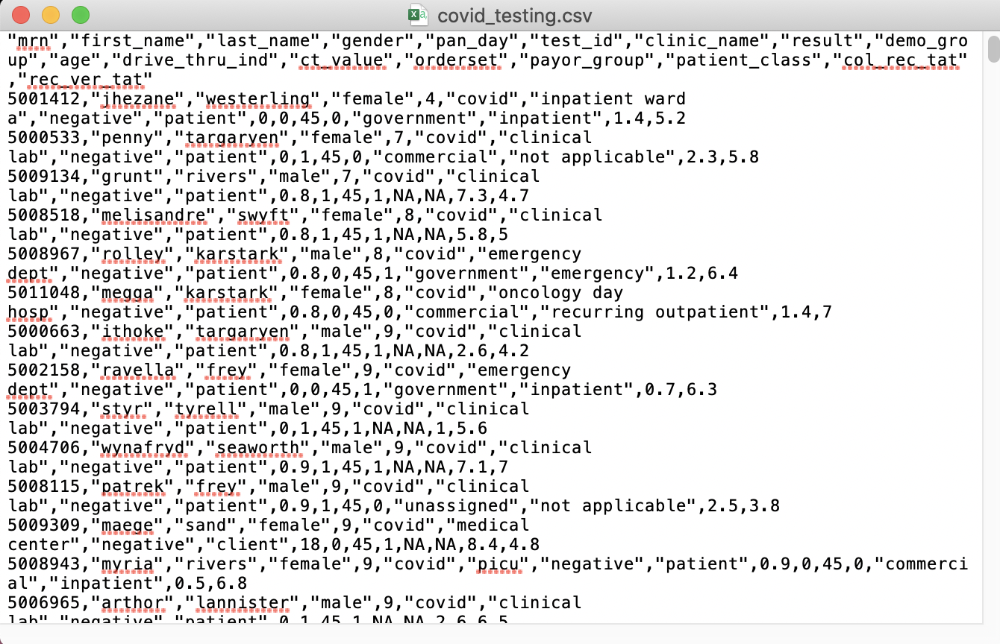
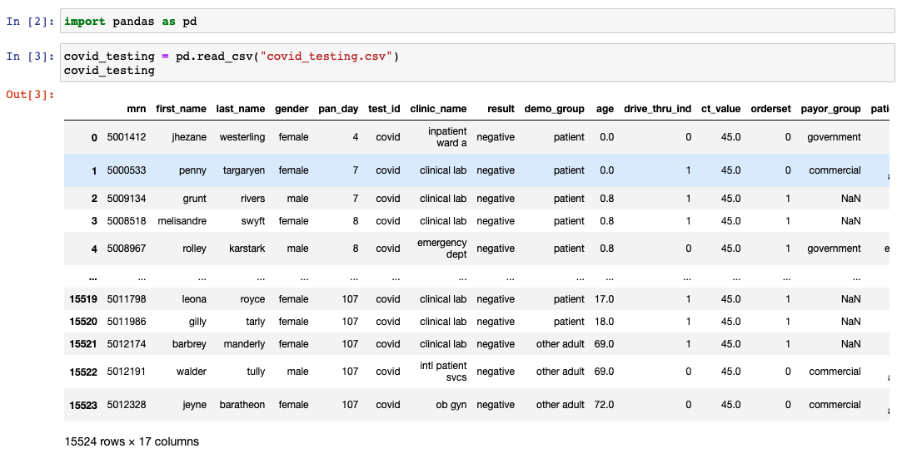
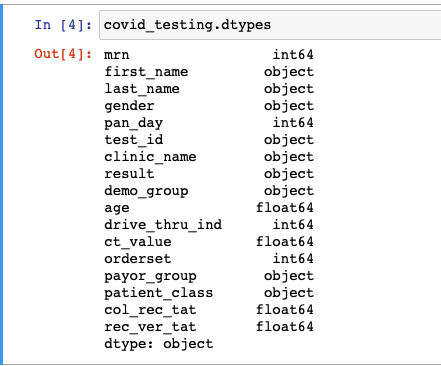
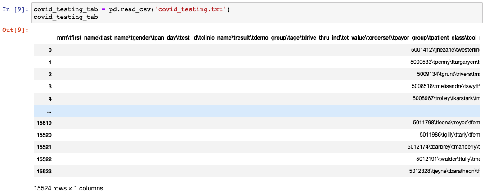
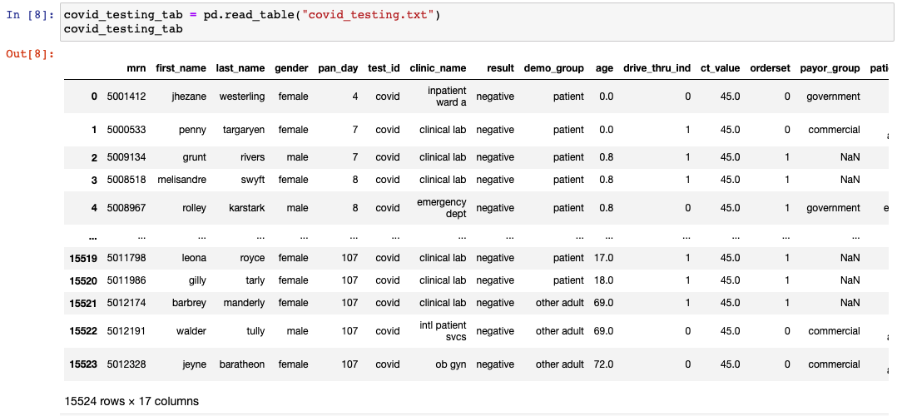

<!--

author:   Meredith Lee
email:    leemc@chop.edu
version:  0.0.1
language: en
narrator: UK English Female
title: Data Science with Python Part I: Importing Text Data
comment: This module covers data import in Python using several libraries including pandas and various sql connection drivers.
long_description: The first step in using Python for data science is importing your data. This module will teach you how to get your data into a useful format for analysis in Python, whether your data are in a spreadsheet, on the internet, or in a relational database.

@learning_objectives

After completion of this module, learners will be able to:

- Identify what kind of data they need to bring into Python
- Use the appropriate package to import their data
- Know what parameters to specify to parse their data correctly
- Get their data into a useful format for cleaning and analysis

@end

link:  https://chop-dbhi-arcus-education-website-assets.s3.amazonaws.com/css/styles.css

script: https://kit.fontawesome.com/83b2343bd4.js

-->

# Data Science with Python Part I: Data Import

<div class = "overview">

## Overview
@comment

**Is this module right for me?** @long_description

**Estimated time to completion:**

**Pre-requisites**

This module assumes some basic familiarity with the Python programming language. If you are brand new to Python, consider checking out [the Introduction to Python module](https://liascript.github.io/course/?https://raw.githubusercontent.com/arcus/education_modules/main/intro_to_python/intro_to_python.md) first. It is also useful to be familiar with working with tabular data (data organized into rows and columns).

**Learning Objectives**

@learning_objectives

</div>

## pandas

The primary toolset for data wrangling and analysis in Python is **pandas**. If you have downloaded Python using Anaconda, pandas should already be installed; if you just installed Python itself, you might need to install pandas using **pip** (for more information, check out [these instructions for using pip to install packages](https://packaging.python.org/en/latest/tutorials/installing-packages/#use-pip-for-installing)). The pandas toolset includes lots of useful functions for working with data, and we will be using it a lot in this series!

The first step in data analysis is actually having Python read your data. Luckily, pandas has a lot of functions for importing a variety of data types, including plain text, web data, data stored in databases, or even image data.

## Tabular data

Often, the data that you will want to analyze in Python will be tabular, or organized into rows and columns. The data could be in a flat file format (such as a CSV) or be stored in a database that can be queried. There are ways to import many kinds of data in pandas. We'll start with one of the most common use cases: reading in CSV files.

### CSV

A CSV, or a **comma-separated values** file (sometimes you'll see them referred to as comma-delimited), is a text file in which elements of a list of data are separated by commas. If you opened a CSV in a text editor, you might see something like this:



This may look a little strange, but it's actually an efficient way to store data in a tabular format, which you can then view in a text editor or a spreadsheet program, or open with a programming language like Python!

To open the covid testing CSV above, you would load the pandas toolset using the code `import pandas as pd` (the "as pd" is not strictly necessary, but it gives you a nice short alias to use later, and it is conventional in Python programming). Then you would use the function `pd.read_csv()` like this:

```python
covid_testing = pd.read_csv("covid_testing.csv")
```

This function reads the file covid_testing.csv using parsers that identify the variables, observations, and data types in the file. Because we're using a CSV-specific function, the parser automatically looks for the variables to be separated by commas, but you can change that using the `sep` or `delimiter` arguments. [For more information about `pandas.read_csv()`, including other arguments, check out the documentation](https://pandas.pydata.org/docs/reference/api/pandas.read_csv.html).

This function has also created a DataFrame called `covid_testing` containing the data from covid_testing.csv:



A DataFrame is a data structure in pandas that can be thought of as a table with rows and columns of labeled data.

<div class = "important">

The one required argument for `pandas.read_csv()` is a string (remember the quotation marks!) that is object to be read, which can be a file, a file path, or a URL. If your file is in the same **directory** as your Python script or notebook, you can just use the name of the file. If note, you will need to use a file path. [Check out this module for more information about directories and file paths]()

</div>

There are a few more assumptions that `pandas.read_csv()` makes that are important to know:

* The "header" (or column labels) will be taken from the first line of the CSV file. If this isn't the case, you can use the `header` argument to specify the row number(s) that contains the column labels (sometimes there is information at the beginning of the data that aren't actually part of the table itself). If the file doesn't have any column labels at all, or if you want to replace the ones that are there, you can use the `names` argument, passing your list of desired names.

* A new **index** for the DataFrame object will be created (an index is basically the set of row labels for certain Python objects, and it has special properties). If you instead want one of the columns in your data to be the index, you can specify that with the `index_col` argument, using either the column number or name.

  <div class = "warning">

  In Python, indexing starts with 0, not 1. This means that the first row of a DataFrame (or a list, Series, dictionary, etc.) has the label **0**. So does the first column of a DataFrame. Not every programming language works this way, and so it can take some getting used to. Don't worry, it'll become more natural with time!

  </div>

* By default, all of the columns will be included in your new DataFrame. If you only want a subset of columns, you can use the `usecols` argument and pass a list of columns (by column number or name).

* The CSV parsers will make their best guess about what type of data is in each column:

  

  If they guess wrong or you want to specify the data types for some reason, you can use the `dtype` argument and pass a dictionary with the columns and the desired type.

There are other arguments for `pandas.read_csv()`, but these are among the most useful ones to know about.


### Quiz: CSV Files

Which of the following is the **required** parameter for `pandas.read_csv()`?

[(X)] `file_path_or_buffer`
[( )] `sep`
[( )] `header`
[( )] `dtype`
*****************
<div class = "answer">
If you want the default behavior for reading your CSV file with `pandas.read_csv()`, you only need to specify the name or path of the file you want to read.
</div>
*****************

### Excel files

There are a couple of ways to read Excel files into Python. If the data in your Excel file is tabular, you can save the file as a CSV (though you'll get a warning that some information might be lost, CSV's are flat files that can only contain plain text) and then use `pandas.read_csv()`. Alternatively, you can read in the Excel file directly using `pandas.read_excel()`. The method is very similar to reading a CSV, using many of the same defaults and arguments as `pandas.read_csv()`.

<div class = "important">

If your Excel file has more than one sheet, the default is to create a DataFrame from only the first sheet (remember that this will be sheet **0** in Python). The `sheet_name` argument will allow you to load more than one sheet (passing a list of sheet numbers or names, or `None` to get all sheets).

</div>

### Other plain text files

Python can actually read all kinds of plain text files. Besides just like elements in CSV files are separated by commas, there are other separators (or **delimiters**) that are sometimes used, such as colons, tabs, spaces, or vertical bars (also called **pipes**). These types of files can generally be called **delimiter separated values** files, or DSVs. There are a couple of options to read files with these other delimiters:

* Use `pandas.read_csv()`, but instead of using the default `sep` or `delimiter` argument, you can pass the delimiter used in your file. For example, if our covid testing file was tab-separated rather than comma-separated, you could use the following code:

  ```python
  covid_testing = pd.read_csv("covid_testing.txt", sep = "\t")
  ```

  The resulting DataFrame will look exactly like the previous one, where we read in the CSV. If you forgot to specify the new separator, you'd get something that looks like this:

  

  <div class = "important">

  `\t` is an example of an **escape character**; since the Python code above can't include literal tabs, we need a way to represent them in code when data that we're importing contains them.

  </div>

 * Use the function `pandas.read_table()`. It works pretty much exactly the same way as `pandas.read_csv()`, except that the default separator is a tab instead of a comma:

  ```python
  covid_testing = pd.read_table("covid_testing.txt")
  ```

  

### Quiz: Delimiter separated files

What is the parameter in `pandas.read_csv()` and `pandas.read_table()` that specifies the separator in your file? Select all that apply.

[[X]] `sep`
[[ ]] `separator`
[[ ]] `comma`
[[X]] `delimiter`
*****************
<div class = "answer">
You can use either the `sep` or `delimiter` parameters to tell Python what delimiter is used in your data file. Delimiters are sometimes called separators, and are commas in a CSV file (but can be other characters-- read on to find out more!).
</div>
*****************


## JSON and XML

Not all of the data you might want to analyze in Python will necessarily be tabular. Two other flat data file types you might need to work with are JSON ("JaveScript Object Notation") and XML (eXtensible Markup Language).

JSON
-------

JSON (which you may hear pronounced either like "JACE-on" or "Jason", like the name) is a file format to transmit text data using attribute-value pairs, and is frequently used to pass data back and forth in web applications. While tabular file formats like CSV are good for data that have one value per field for each observation, JSON and similar file formats are useful when you may have several values per field. JSON looks like this:

```json
{
  "first_grade": {
    "students": [
      {
        "id": "012345",
        "first_name": "Mary",
        "middle_name": "Elizabeth",
        "last_name": "Doe",
        "age": 6,
        "contact": {
          "phone": [
            "215-123-4567",
            "215-111-2222"
          ]
        },
        "guardian": [
            "Janice Doe",
            "Martha Wills"
        ]
      },
      {
        "id": "012346",
        "first_name": "Sakima",
        "last_name": "Dwan",
        "age": 7,
        "contact": {
          "phone": "215-654-3210",
          "email": "dwans@school.mail"
        },
        "guardian": "Eyram Dwan"
      }
    ]
  }
}
```
There are a few ways to bring JSON data into Python. If you want to create a DataFrame (a table) of your data, you can use the pandas function `read_json()`. This is generally useful when the JSON file was previously created from a DataFrame (which can be done with function `DataFrame.to_json()`, [see the documentation for more information](https://pandas.pydata.org/docs/reference/api/pandas.DataFrame.to_json.html#pandas.DataFrame.to_json)), or if you know that the data will fit nicely in a two-dimensional tabular format for some other reason.

There are many parameters that you can specify for `pandas.read_json()`, which you may or may not use ([check out the documentation to read about all of them](https://pandas.pydata.org/docs/reference/api/pandas.read_json.html#pandas.read_json)), but there are a couple that can be particularly useful:

* `orient`: This tells pandas how the JSON strings are formatted. This is important, as it determines what goes where in your DataFrame (basically, how the rows, columns, and indices are represented in the JSON). If the JSON was created using `DataFrame.to_json()`, the `orient` parameters should match. If not, you may need to investigate the JSON, or try a few and see what works! The [documentation](https://pandas.pydata.org/docs/reference/api/pandas.read_json.html#pandas.read_json) will have the possible values `orient` and take.

* `dtype`: The default in almost all cases will be True, meaning that the function will try to infer the types of your values (string, integer, etc.). If you don't want this, you can pass False if you don't want the data types inferred at all, or a dictionary with your desired data types.

XML
------

XML is another way that data is transmitting over the internet. It is a markup language, and so the data are categorized and labeled in an organized way, surrounded by "tags" that describe the data that are stored. The formatting is very strict.

Here is what XML looks like, using the same student records as above:

```XML
<?xml version="1.0" encoding="UTF-8"?>
<first_grade>
<student id="012345">
  <name>
    <first>Mary</first>
    <middle>Elizabeth</middle>
    <last>Doe</last>
  </name>
  <age>6</age>
  <contact>
    <phone>215-123-4567</phone>
    <phone>2215-111-2222</phone>
  </contact>
  <guardians>
    <guardian>Janice Doe</guardian>
    <guardian>Martha Wills</guardian>
  </guardians>
</student>

<student id="012346">
  <name>
    <first>Sakima</first>
    <last>Dwan</last>
  </name>
  <age>7</age>
  <contact>
    <phone>215-654-3210</phone>
    <email>dwans@school.mail</email>
  </contact>
  <guardians>
    <guardian>Eyram Dwan</guardian>
  </guardians>
</student>
</first_grade>
```

XML has largely been replaced by JSON, but if you do end up encountering it, pandas does have a function to import XML data: `pandas.read_xml()`. This method works well if the XML data is such that it will tidily fit in a two-dimensional tabular shape.

If the XML data can't become neatly 2-D, Python has several other modules and libraries you can use for XML parsing, including [`xml.etree.ElementTree`](https://docs.python.org/3.5/library/xml.etree.elementtree.html), [`untangle`](https://untangle.readthedocs.io/en/latest/), and [`xmltodict`](https://pypi.org/project/xmltodict/). We're won't go into detail here, but check out those resources if you're interested in working more with XML data in Python.

### Quiz: JSON and XML

Which of the following are **not** true about JSON and XML?

[( )] JSON and XML are both formats by which data are transmitted over the internet.
[(X)] Neither JSON nor XML data can be analyzed in Python.
[( )] JSON and XML can be imported into Python in a DataFrame, or as another Python object, such as a dictionary.
*****************
<div class = "answer">
JSON and XML, file formats that are used to transmit data over the internet, can both be analyzed in Python.
</div>
*****************

## Relational databases

To import data from a relational database, such as a SQL database (check out [this article about SQL if you're unfamiliar](https://education.arcus.chop.edu/sql-intro/)), you'll first need a connection to that database; what this looks like will depend on the database.

* SQLite databases are among the simplest to access with Python, and there's a module you can import that will allow you to connect to and retrieve data from a SQLite database: [`sqlite3`](https://docs.python.org/3/library/sqlite3.html)

* For other SQL databases, such as MySQL, PostgresSQL, or BigQuery SQL, you will have to install separate drivers or clients to connect. Each will have their own syntax and quirks, so read the documentation carefully!

  * To connect to and interact with a MySQL database, you can use the MySQL Connector/Python package, which you can install with **pip** (the Python package installer) by running `pip install mysql-connector-python` or with Anaconda by running `conda install mysql-connector-python` in your operating system's command line program. [This resource has more detail about using a MySQL database with Python](https://realpython.com/python-mysql/).

  <div class = "learnmore">
  Check out [Command Line 101](https://liascript.github.io/course/?https://raw.githubusercontent.com/arcus/education_modules/main/bash_scripting_101/bash_scripting_101.md#1) for more information about using the Command Line on your own computer.
  </div>

  * If using a PostgresSQL database, you can install the **psycopg2** driver instead. Check out the [Psycopg documentation](https://www.psycopg.org/docs/) for more information.

  * For a BigQuery SQL database, the driver is google-cloud-bigquery (check out the [BigQuery client libraries documentation](https://cloud.google.com/bigquery/docs/quickstarts/quickstart-client-libraries) for more information about using BigQuery with Python and other programming languages).

<div class = "important">
When connecting with an external database, there might be authentication steps to take to access the data.
</div>

### Quiz: Relational databases

Which of these statements are true about relational databases in Python?

[( )] It is not possible to connect to external databases in Python.
[(X)] To connect to relational databases in Python, you need to install external drivers.
[( )] In Python, you never have to authenticate to access a database.
*****************
<div class = "answer">
It is absolutely possible to connect to external relational databases with Python; you just need to install the correct drivers! Be warned, you may need to authenticate, for example when you connect to a BigQuery database (BigQuery is a Google product).
</div>
*****************


## Additional Resources

* W3schools has a variety of simple programming tutorials in a variety of languages, including Python, with simple code that you can run right right on the page:
  * Here is [a tutorial about working with `pandas.read_csv()`](https://www.w3schools.com/python/pandas/pandas_csv.asp)
  * And [one about working with `read_json()`](https://www.w3schools.com/python/pandas/pandas_json.asp).
* [Learn more about CSV, JSON, and XML file formats here](https://education.arcus.chop.edu/data-types/)
* Check out [this article you are curious to learn more about file paths](https://education.arcus.chop.edu/file-paths/)

## Feedback

In the beginning, we stated some goals.

**Learning Objectives:**

@learning_objectives

We ask you to fill out a brief (5 minutes or less) survey to let us know:

* If we achieved the learning objectives
* If the module difficulty was appropriate
* If we gave you the experience you expected

We gather this information in order to iteratively improve our work.  Thank you in advance for filling out [our brief survey](https://redcap.chop.edu/surveys/?s=KHTXCXJJ93&module_name=%22Data+Import+in+Python%22)!
